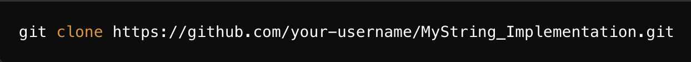
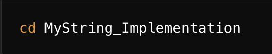
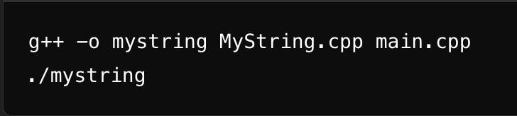
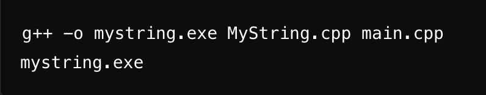

# MyString_Implementation
A custom string class implementation in C++.
This repository contains the implementation of string-related functionality in C++. Follow the instructions below to clone and run the code on your local machine.

How to Clone and Run MyString_Implementation Locally
Once the repository is uploaded, users can download and run it using the following steps:

1. Clone the Repository
Open a terminal/command prompt and run the following command to clone the repository:

2. Navigate to the Folder
Once the repository is cloned, navigate to the project directory:

3. Compile and Run the Code
For Linux/macOS:
Use the following commands to compile and run the code:

4. For Windows (Using MinGW):
Use the following commands to compile and run the code:

Thank You!
Thank you for checking out MyString_Implementation! I hope you find the project useful. If you have any suggestions, feedback, or improvements, feel free to share them. Your thoughts and contributions are always welcome!

Show Your Support:
If you found this project helpful or interesting, please consider starring the repository ⭐. It motivates me to keep improving and sharing more projects.
